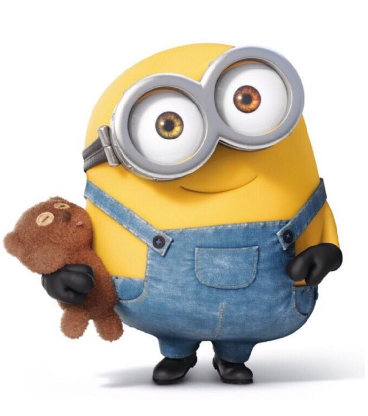
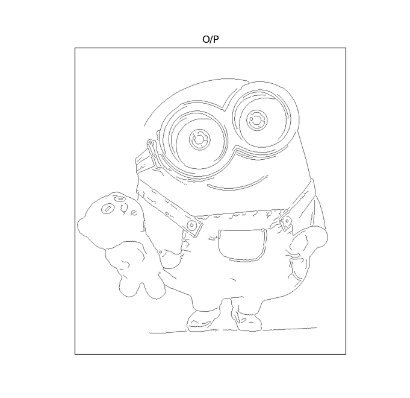
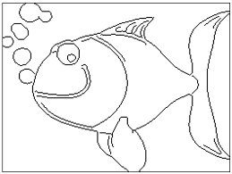
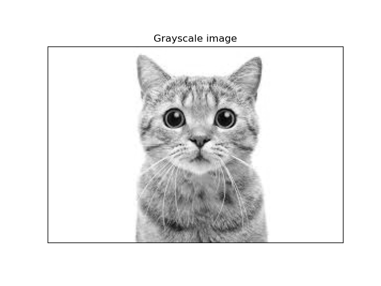
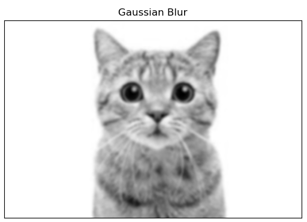
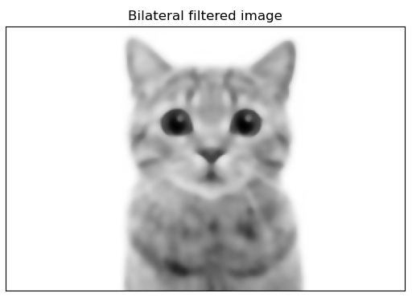
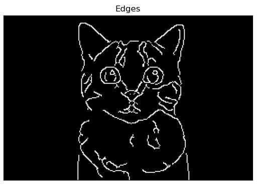
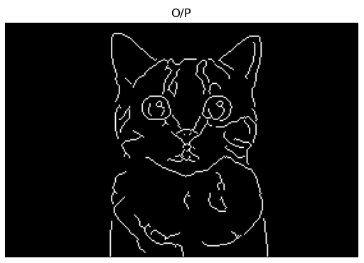
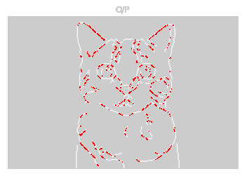
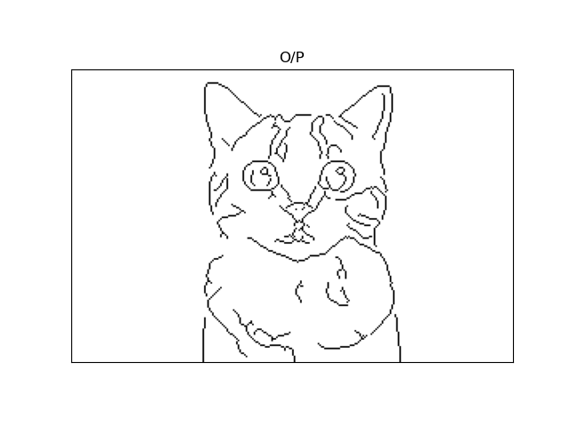

# Line_Art_Creator
Convert any image to line art using image processing

## Sample images
|Image|Line art|
|--|--|
|||
|||
|||

## Installation
This software does not require installation however the user should have Python (3.6 or above) installed.

Python can be downloaded from www.python.org

## Usage
1. Install required modules  
<code>pip install -r requirements.txt </code>

2. This program can be used with a CLI or a Browser

#### Using in a CLI
Run the following command in command prompt/terminal  
<code>python edges.py [-h] [-img IMG] [-alpha ALPHA]</code>

|Option|Description|
|--|--|
|-img|extract edges from this image|
|-alpha|use if very few or no edges detected [Accepts values from 0 to 200]|
|-h, --help|show this help message and exit|

#### Using in a Browser
1. Run the following command in command prompt/terminal  
<code>python app.py</code>

1. Open your favorite browser & point to https://localhost:5000
  
## Ignore this section if not a geek or a nerd
#### Steps involved in converting an image to line art

1. Get the image from the user

2. Convert the image to a grayscale image

3. Apply gaussian filter to remove noise from the image

4. Apply median filter to remove 'salt and pepper' noise

5. Apply bilateral filter to remove more noise from the image

6. Use Canny edge detector to detect edges   
**Note**:Edge detection is achieved mostly by the Sobel filter present in Canny edge detector  
A parameter named alpha is utilized to setup the hysteresis levels  

7. Use Guo-Hall thinning for skeletonizing the image

**Note**: The effect of thinning can be observed in the image below (Removed areas marked in red):  

8. Invert the pixels in the image

#### After all the above image processing we get the lines of the line art

## Bonus
The generated line art can be further converted to ASCII text art using an ANN

Use the following website: https://tar-bin.github.io/DeepAAonWeb/

Repository link on github: https://github.com/OsciiArt/DeepAA

### Made with lots of ⏱️, 📚 and ☕ by InputBlackBoxOutput
